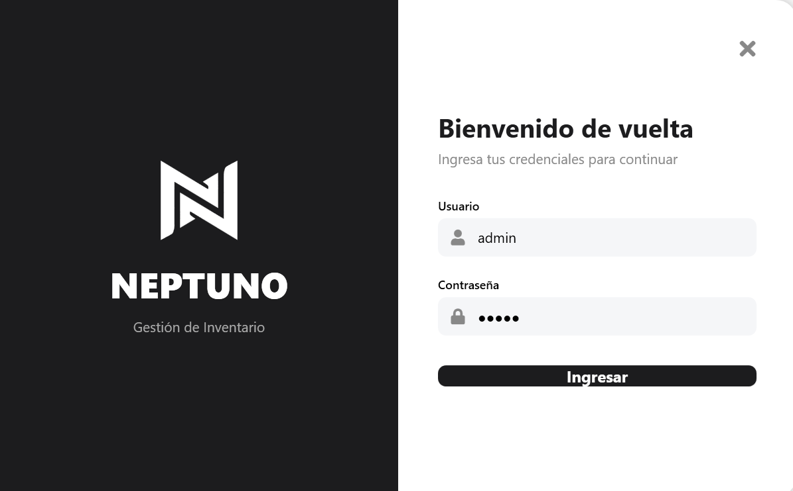
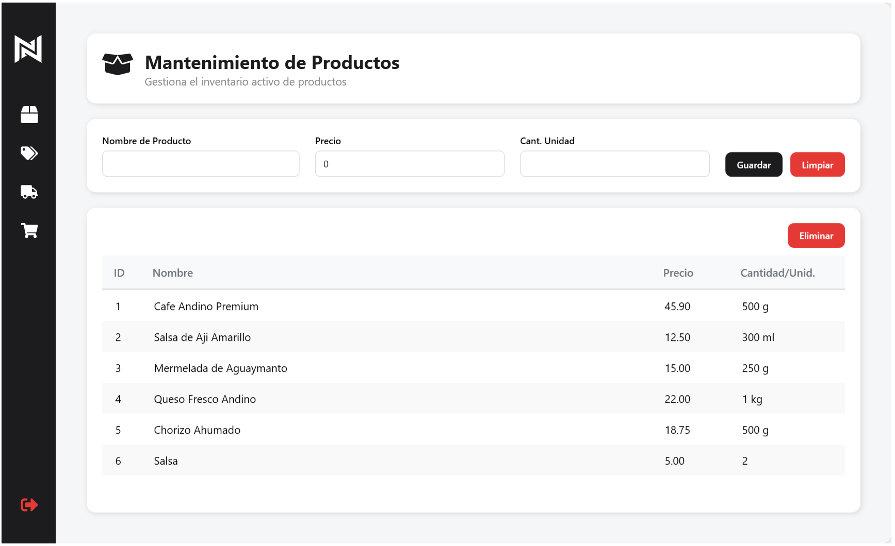
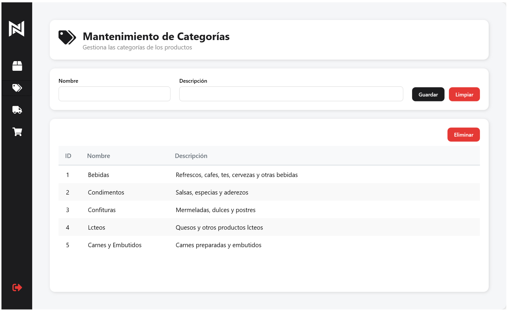
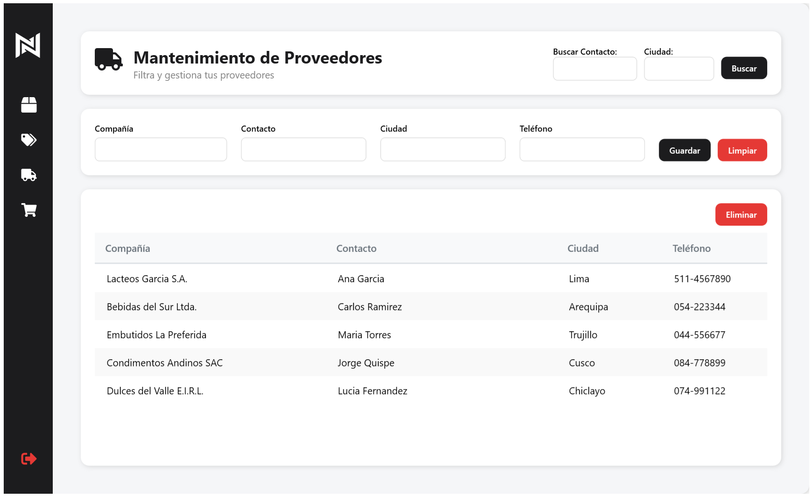
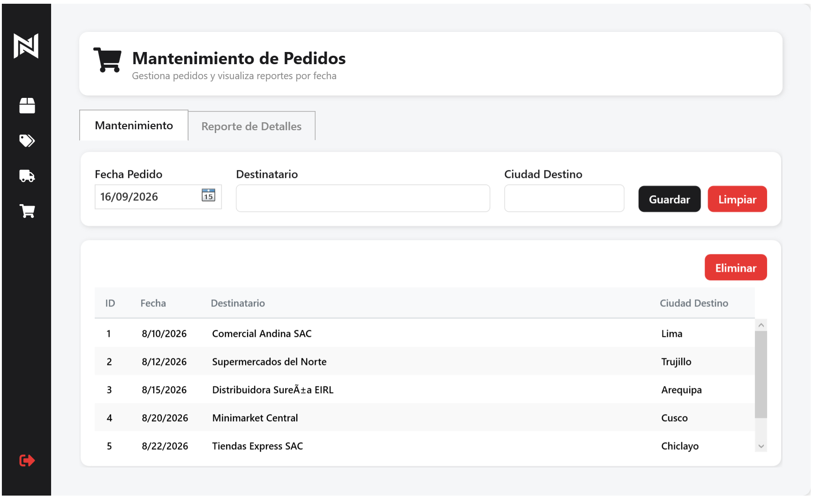
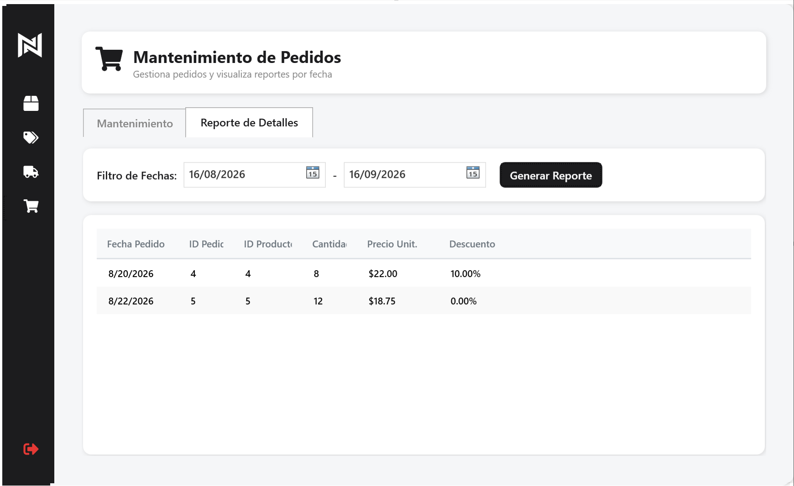

# Neptuno APP - Sistema de Gestión e Inventario (WPF MVVM)

Una aplicación de escritorio moderna desarrollada en C# con **WPF (Windows Presentation Foundation)** y **ADO.NET**. Implementa estrictamente el patrón arquitectónico **MVVM (Model-View-ViewModel)** para asegurar un código limpio, mantenible y escalable.

## 🚀 Características Principales

- **Arquitectura MVVM:** Separación total entre la lógica de negocio (ViewModels) y la interfaz de usuario (Views).
- **Diseño Moderno (UI/UX):** Interfaz "Chromeless" (sin bordes de Windows), con esquinas redondeadas, sombras (DropShadow), y un menú lateral colapsable (Push Sidebar) con animaciones suaves.
- **Acceso a Datos Directo (ADO.NET):** Uso optimizado de `SqlDataReader` y `SqlCommand` (ExecuteNonQuery) conectándose mediante Stored Procedures para máximo rendimiento.
- **Eliminación Lógica (Soft Delete):** Ningún registro se borra físicamente. Todo usa un campo `Activo` en la base de datos para preservar la integridad histórica de pedidos y facturación.
- **Login Estilizado:** Pantalla de autenticación personalizada que aprovecha gráficos vectoriales (SVG convertidos a Path XAML) sin dependencias externas.

## 📁 Módulos y Vistas

### 🔐 Pantalla de Autenticación (Login)


### 1. 📦 Productos
Mantenimiento (CRUD) con alta, edición y baja lógica de productos.


### 2. 🏷️ Categorías
Gestión detallada de las categorías del inventario.


### 3. 🚚 Proveedores
Incluye búsquedas avanzadas (por contacto y ciudad) a través de procedimientos almacenados.


### 4. 🛒 Pedidos (Mantenimiento y Reportes)
Sistema híbrido que incluye un CRUD de pedidos y una pestaña especializada de **Reportes de Detalles** filtrados por rango de fechas (`FechaInicio` y `FechaFin`).



## 🛠️ Requisitos del Sistema

- **Framework:** .NET Framework 4.7.2
- **Base de Datos:** SQL Server (Express o Developer)
- **IDE Recomendado:** Visual Studio 2019 / 2022

## ⚙️ Instalación y Ejecución

Sigue estos pasos para desplegar el proyecto localmente:

### 1. Configurar la Base de Datos
1. Abre **SQL Server Management Studio (SSMS)**.
2. Carga y ejecuta el script proporcionado: `Mejora-NeptunoDB.sql`. 
   *Este script creará la base de datos `Mejora_NeptunoDB`, todas sus tablas (con el campo `Activo`), insertará datos de prueba, y creará todos los Procedimientos Almacenados (CRUD y listados) requeridos.*

### 2. Configurar la Cadena de Conexión
1. Abre el proyecto (`Mejora-NeptunoAPP.sln`) en Visual Studio.
2. Abre el archivo `App.config`.
3. Modifica el atributo `connectionString` dentro de la etiqueta `<connectionStrings>` para que apunte a tu servidor SQL local. Ejemplo:
   ```xml
   <connectionStrings>
       <add name="NeptunoDB" 
            connectionString="Data Source=TU_SERVIDOR\SQLEXPRESS;Initial Catalog=Mejora_NeptunoDB;Integrated Security=True;Encrypt=True;TrustServerCertificate=True;" 
            providerName="System.Data.SqlClient" />
   </connectionStrings>
   ```

### 3. Compilar y Ejecutar
1. En Visual Studio, ve al menú **Compilar** (Build) y selecciona **Limpiar Solución** (Clean Solution).
2. Selecciona **Recompilar Solución** (Rebuild Solution). Esto restaurará los paquetes NuGet (como `MahApps.Metro.IconPacks.FontAwesome`).
3. Presiona **F5** (o haz clic en "Iniciar") para correr la aplicación.
4. **Credenciales por defecto:**
   - **Usuario:** `admin`
   - **Contraseña:** `admin`

## 👨‍💻 Tecnologías Utilizadas

- **C# / WPF** (Presentación y Binding)
- **ADO.NET** (Data Access)
- **SQL Server / T-SQL** (Base de datos y Stored Procedures)
- **MahApps.Metro.IconPacks** (Iconografía vectorial)
